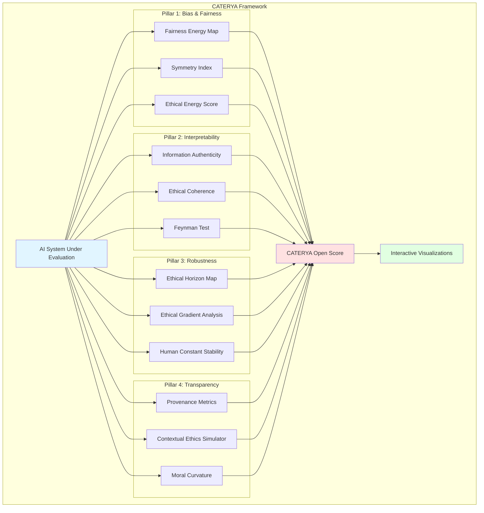

# CATERYA - Ethical AI Evaluation Framework

[](LICENSE)
[](https://www.python.org/downloads/)
[](https://github.com/AryHHAry/CATERYA-Ethical-AI-Evaluation-Framework)

> **Contextual, Authentic, Transparent, Ethical, Responsible, Yield-focused**

---

## The Question

In the fragility of human relationships—riddled with biases, misunderstandings, and broken trust—lies a profound question: **Can we build human-machine relationships that are more trustworthy, quantified with the rigor of theoretical physics?**

When we struggle to trust each other, when algorithmic decisions shape lives without explanation, when AI systems perpetuate historical inequities at scale—we need more than guidelines. We need measurement. We need principles as fundamental as the laws of nature.

---

## What is CATERYA?

CATERYA is an **open-source Python framework** for evaluating AI trustworthiness through physics-inspired principles. It transforms abstract ethical concepts into **quantifiable, repeatable, testable metrics**—treating AI ethics with the same rigor we apply to physical laws.

This is not a black-box SaaS product. This is not proprietary scoring. This is a **modular, auditable foundation** that researchers, regulators, and organizations can fork, extend, and verify independently.

### Philosophy

- **Anti-centralization**: No single entity should monopolize ethical evaluation
- **Physics-inspired rigor**: Energy landscapes, symmetry principles, information theory
- **Open by design**: Every metric, every formula, every dataset—open to scrutiny
- **Community-driven**: Built for and by the global AI ethics community

---

## The Four Pillars

CATERYA is structured around four fundamental principles, each mapped to physics analogies:

### 1. **Bias & Fairness** → Energy Landscape Principle

AI systems, like physical systems, seek local minima. Bias represents energy wells that trap models in unfair configurations.

**Key Metrics:**
- **Fairness Energy Map**: 3D visualization of utility-fairness-interpretability trade-offs
- **Symmetry Index**: Measures symmetry breaking across demographic groups
- **Ethical Energy Score**: Combines computational cost, bias magnitude, and social impact

*Analogy*: Just as a marble rolls into valleys in a landscape, AI models settle into biased states. We map this terrain to identify and escape these traps.

### 2. **Interpretability** → Information Principle

True understanding requires information authenticity—distinguishing genuine comprehension from statistical pattern matching.

**Key Metrics:**
- **Information Authenticity**: Contextual understanding vs. surface correlations
- **Ethical Coherence Score**: Stability of ethical reasoning under pressure
- **Feynman Test for AI Ethics**: Can the system explain its reasoning simply?

*Analogy*: Like measuring information entropy in physics, we quantify how much "meaning" an AI truly captures versus memorizes.

### 3. **Robustness** → Stability Principle

Ethical AI must remain stable across contexts, like fundamental constants in physics.

**Key Metrics:**
- **Ethical Horizon Map**: Visualization of decision boundaries (event horizons) beyond which ethics break down
- **Ethical Gradient Analysis**: Rate of ethical decay under adversarial conditions
- **Human Constant Stability**: Preservation of human values across interactions

*Analogy*: Similar to event horizons in black holes, we identify points of no return where AI systems lose ethical grounding.

### 4. **Transparency & Accountability** → Entanglement Principle

Every AI output is entangled with its training data, model architecture, and human decisions. Full provenance must be traceable.

**Key Metrics:**
- **Provenance Metrics**: Data lineage, model card completeness, accountability audit trails
- **Contextual Ethics Simulator**: Test decisions across cultural/temporal contexts
- **Moral Curvature**: Adaptability to diverse ethical frameworks
- **Output Provenance Markers**: C2PA-style attribution for AI-generated content

*Analogy*: Like quantum entanglement, AI decisions are inseparable from their origins. We trace these connections.

---

## Core Concepts

### The Entropy-Symmetry-Information Triangle

A three-dimensional framework balancing:
- **Entropy**: Diversity of perspectives and contexts
- **Symmetry**: Fairness and consistency across groups
- **Information**: Authentic understanding and transparency

The **Golden Triangle Zone** represents optimal balance across all three dimensions.

### Advanced Metrics

- **Meaningful Scaling Index (MSI)**: Does increased model size lead to proportional ethical improvement?
- **Quantum-Inspired Learning Metrics**: Coherence of semantic understanding
- **Problem-First Scorecard**: Evaluate AI projects by the problems they solve, not just technical capabilities
- **CATERYA Open Score**: Public, verifiable trustworthiness score (0-100)

### First-Principle Sustainability

For agricultural and energy AI applications: Nature's principles before technological optimization. Biomimetic approaches over brute force.

---

## Architecture



---

## Quick Start

### Installation

```bash
# Clone the repository
git clone https://github.com/AryHHAry/CATERYA-Ethical-AI-Evaluation-Framework.git
cd CATERYA-Ethical-AI-Evaluation-Framework

# Install in development mode
pip install -e .
```

### Basic Usage

```python
from caterya import CATERYAEvaluator
from caterya.metrics import FairnessEnergyMap, EthicalHorizonMap

# Initialize evaluator
evaluator = CATERYAEvaluator()

# Load your model and dataset
model = ...  # Your AI model
dataset = ...  # Your evaluation dataset

# Run comprehensive evaluation
results = evaluator.evaluate(
    model=model,
    dataset=dataset,
    pillars=['bias', 'interpretability', 'robustness', 'transparency']
)

# Get CATERYA Open Score
print(f"Trust Score: {results['open_score']:.2f}/100")

# Generate interactive visualizations
results.generate_visualizations(output_dir='./reports')
```

### Docker

```bash
# Build and run
docker build -t caterya .
docker run -p 8501:8501 caterya

# Access Streamlit dashboard at http://localhost:8501
```

### Demo with Synthetic Data

```bash
# Run demonstration evaluation
python examples/run_demo.py

# Launch interactive dashboard
streamlit run examples/streamlit_app.py
```

**📚 For detailed instructions, see**:
- **[QUICKSTART.md](QUICKSTART.md)**: Get started in 5 minutes
- **[DEPLOYMENT.md](DEPLOYMENT.md)**: Complete deployment guide for all platforms

---

## Technology Stack

**Core**: Python 3.8+, PyTorch (CPU/GPU), NumPy, SciPy  
**ML/AI**: Transformers, SHAP, LIME  
**Visualization**: Plotly, Matplotlib  
**Deployment**: Docker, Streamlit, Jupyter  
**Testing**: pytest, unittest

**Design Philosophy**: Lightweight, modular, extensible. Runs on commodity hardware (Ryzen 7 16GB integrated GPU, i5 8GB GTX 730).

---

## Project Structure

```
CATERYA-Ethical-AI-Evaluation-Framework/
├── src/caterya/              # Core framework
│   ├── core.py               # Main evaluator
│   ├── metrics/              # All evaluation metrics
│   ├── visualizers/          # Interactive plots
│   ├── simulators/           # Context simulators
│   └── utils/                # Helper functions
├── examples/                 # Usage examples
│   ├── run_demo.py          # CLI demo
│   └── streamlit_app.py     # Web dashboard
├── data/synthetic/          # Example datasets
├── docs/                    # Documentation
│   ├── math.md              # Mathematical foundations
│   └── architecture.md      # System design
├── tests/                   # Test suite
├── requirements.txt         # Dependencies
├── Dockerfile              # Container setup
└── setup.py                # Package configuration
```

---

## Research Impact

This project represents a bridge between theoretical physics and applied AI ethics. By treating trustworthiness as a quantifiable property with conservation laws and symmetry principles, we can:

- **Standardize** ethical evaluation across organizations
- **Democratize** access to trustworthy AI assessment
- **Accelerate** research through reproducible metrics
- **Enable** regulatory compliance with verifiable scores

---

## Vision

CATERYA is designed as a foundation for:

- **Quantum-ready metrics** (integration with Pennylane, Cirq)
- **Multimodal AI evaluation** (vision, text, audio via CLIP, Whisper)
- **Edge computing deployment** (ONNX, TensorFlow Lite export)
- **Multi-agent ethics** (autonomous systems coordination)
- **Global democratization** (multilingual, low-resource support)
- **Open governance evolution** (EU AI Act compliance)

See [VISION.md](VISION.md) for detailed roadmap.

---

## Contributing

We welcome contributions from physicists, AI researchers, ethicists, regulators, and developers worldwide.

**How to contribute:**
1. Fork the repository
2. Create a feature branch (`git checkout -b feature/amazing-metric`)
3. Commit your changes (`git commit -m 'Add quantum coherence metric'`)
4. Push to the branch (`git push origin feature/amazing-metric`)
5. Open a Pull Request

See [CONTRIBUTING.md](CONTRIBUTING.md) for detailed guidelines.

**Join the conversation**: [GitHub Discussions](https://github.com/AryHHAry/CATERYA-Ethical-AI-Evaluation-Framework/discussions)

---

## Governance

CATERYA is governed by principles of **openness, scientific rigor, and community consensus**. We actively resist capture by any single organization or commercial interest.

See [GOVERNANCE.md](GOVERNANCE.md) for our decision-making process and [COLLABORATION_PATHWAY.md](COLLABORATION_PATHWAY.md) for partnership opportunities.

---

## Citation

If you use CATERYA in your research, please cite:

```bibtex
@software{caterya2026,
  author = {Ary HH},
  title = {CATERYA: Physics-Inspired Ethical AI Evaluation Framework},
  year = {2026},
  url = {https://github.com/AryHHAry/CATERYA-Ethical-AI-Evaluation-Framework},
  note = {Open-source framework for quantifiable AI trustworthiness}
}
```

---

## License

Apache 2.0 with Patent Grant Clause. See [LICENSE](LICENSE) for details.

This ensures:
- Freedom to use, modify, and distribute
- Protection for contributors from patent litigation
- Compatibility with both open-source and commercial projects

---

## Contact

**Created and maintained by Ary HH**  
Email: aryhharyanto@proton.me  
GitHub: [@AryHHAry](https://github.com/AryHHAry)

*"Between the particles of computation and the singular star of human consciousness, we measure trust."*

---

## Acknowledgments

This framework stands on the shoulders of:
- The open-source AI community
- Researchers advancing interpretability and fairness
- Organizations championing AI transparency
- Every individual questioning algorithmic power

**Together, we can build AI systems worthy of trust.**

---

*CATERYA: Because trust, like energy, must be conserved.*
