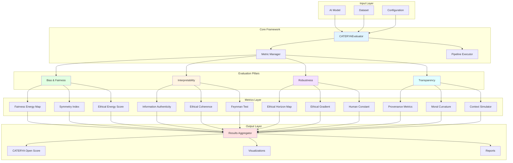
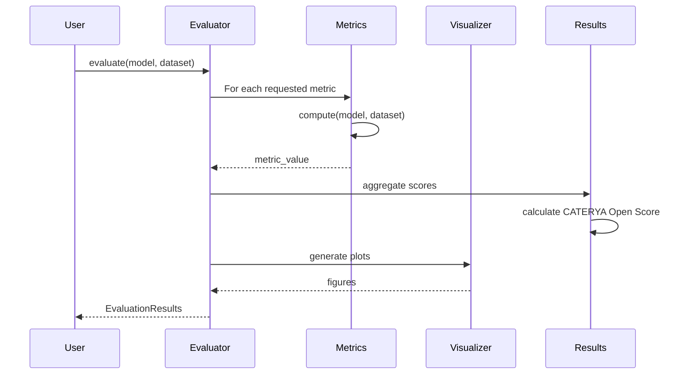

# CATERYA Architecture

**Created and maintained by Ary HH (aryhharyanto@proton.me)**

---

## Overview

CATERYA is designed as a modular, extensible framework for AI ethics evaluation, inspired by the layered structure of physical theories. Just as physics has fundamental forces (electromagnetic, gravitational, etc.) that combine to explain phenomena, CATERYA has fundamental pillars that combine to quantify trustworthiness.

---

## Design Principles

### 1. Modularity
Each component (metric, visualizer, simulator) is self-contained and swappable. Users can:
- Use individual metrics independently
- Replace default implementations with custom versions
- Extend with new metrics without modifying core code

### 2. Physics-Inspired Structure
```
Trustworthiness = f(Forces) where Forces = [Bias, Opacity, Fragility, Opacity]
                                          [Fairness, Interpretability, Robustness, Transparency]
```

Metrics are "observables" in this framework—quantities we can measure about the system.

### 3. Extensibility
- **Plugin architecture**: Drop-in new metrics via Python imports
- **Configurable pipelines**: YAML/JSON configs for evaluation workflows
- **Multi-backend support**: PyTorch, TensorFlow, JAX, ONNX, scikit-learn

### 4. Performance
- **Lazy evaluation**: Compute metrics only when requested
- **Caching**: Store intermediate results to avoid recomputation
- **Parallelization**: Use multiprocessing/GPU when available
- **Streaming**: Process large datasets in chunks

---

## System Architecture

### High-Level Overview



---

## Component Details

### 1. Core: `CATERYAEvaluator`

**Responsibilities**:
- Coordinate evaluation pipeline
- Manage metric lifecycle (initialization, execution, cleanup)
- Aggregate results into unified score
- Handle errors and logging

**API**:
```python
class CATERYAEvaluator:
    def __init__(self, config: Optional[Dict] = None):
        """Initialize with optional configuration"""
        
    def evaluate(
        self,
        model: Any,
        dataset: Any,
        pillars: List[str] = ['bias', 'interpretability', 'robustness', 'transparency'],
        **kwargs
    ) -> EvaluationResults:
        """Run comprehensive evaluation"""
        
    def evaluate_metric(
        self,
        metric_name: str,
        model: Any,
        dataset: Any,
        **kwargs
    ) -> float:
        """Evaluate single metric"""
```

**Design Pattern**: Facade pattern—provides simple interface to complex subsystems.

---

### 2. Metrics Layer

Each metric is a self-contained class implementing the `Metric` interface:

```python
from abc import ABC, abstractmethod

class Metric(ABC):
    def __init__(self, **config):
        self.config = config
        
    @abstractmethod
    def compute(self, model: Any, dataset: Any, **kwargs) -> float:
        """Compute metric value"""
        pass
        
    @property
    @abstractmethod
    def bounds(self) -> Tuple[float, float]:
        """Return (min, max) possible values"""
        pass
        
    @abstractmethod
    def interpret(self, value: float) -> str:
        """Human-readable interpretation"""
        pass
```

**Example Implementation**:
```python
class SymmetryIndex(Metric):
    def compute(self, model, dataset, groups):
        metrics_per_group = self._compute_per_group_metrics(model, dataset, groups)
        std = np.std(metrics_per_group)
        mean = np.mean(metrics_per_group)
        return 1 - std / (mean + 1e-6)
        
    @property
    def bounds(self):
        return (0.0, 1.0)
        
    def interpret(self, value):
        if value > 0.9:
            return "Excellent symmetry"
        elif value > 0.7:
            return "Good symmetry"
        elif value > 0.5:
            return "Moderate asymmetry"
        else:
            return "Significant asymmetry"
```

---

### 3. Pillar Organization

Metrics are organized by pillar, with each pillar having:

**Structure**:
```
src/caterya/metrics/
├── __init__.py
├── base.py              # Abstract Metric class
├── bias.py              # Pillar 1: Fairness Energy, Symmetry Index, Ethical Energy
├── interpretability.py  # Pillar 2: Info Authenticity, Coherence, Feynman Test
├── robustness.py        # Pillar 3: Horizon Map, Gradient, Human Constant
└── transparency.py      # Pillar 4: Provenance, Curvature, Context Sim
```

**Registry Pattern**:
```python
# metrics/__init__.py
METRIC_REGISTRY = {
    'fairness_energy': FairnessEnergyMap,
    'symmetry_index': SymmetryIndex,
    'ethical_energy': EthicalEnergyScore,
    # ... etc
}

def get_metric(name: str) -> Metric:
    if name not in METRIC_REGISTRY:
        raise ValueError(f"Unknown metric: {name}")
    return METRIC_REGISTRY[name]
```

---

### 4. Visualizers

**Responsibilities**:
- Generate interactive plots (Plotly, Matplotlib)
- Create 3D energy landscapes
- Animate ethical evolution during training
- Export to HTML, PNG, SVG

**Structure**:
```
src/caterya/visualizers/
├── __init__.py
├── base.py               # Abstract Visualizer class
├── energy_landscape.py   # 3D Fairness Energy Map
├── horizon_map.py        # Ethical Horizon visualization
├── dashboard.py          # Aggregate dashboard (Plotly Dash)
└── animations.py         # Temporal evolution plots
```

**API**:
```python
class EnergyLandscapeVisualizer:
    def plot_3d(
        self,
        results: EvaluationResults,
        interactive: bool = True,
        save_path: Optional[str] = None
    ) -> Union[go.Figure, None]:
        """Generate 3D energy landscape plot"""
```

---

### 5. Simulators

**Contextual Ethics Simulator**:

Tests AI decisions across diverse scenarios to reveal hidden biases.

```python
class ContextualEthicsSimulator:
    def simulate(
        self,
        model: Any,
        scenarios: List[Dict],
        contexts: List[str]
    ) -> SimulationResults:
        """
        Run model on scenarios across different contexts
        
        Args:
            scenarios: List of test cases
            contexts: List of cultural/temporal/social contexts
            
        Returns:
            Results showing consistency and adaptation scores
        """
```

**Use Cases**:
- Cross-cultural validation (Western vs. Eastern ethical frameworks)
- Temporal robustness (past vs. present social norms)
- Stakeholder perspectives (patient vs. doctor vs. insurer in healthcare AI)

---

## Data Flow

### Evaluation Pipeline



### Parallel Execution

For independent metrics, parallelize computation:

```python
from concurrent.futures import ThreadPoolExecutor

def evaluate_parallel(self, metrics, model, dataset):
    with ThreadPoolExecutor(max_workers=4) as executor:
        futures = {
            executor.submit(metric.compute, model, dataset): name
            for name, metric in metrics.items()
        }
        results = {}
        for future in as_completed(futures):
            name = futures[future]
            results[name] = future.result()
    return results
```

---

## Configuration System

### YAML Configuration Example

```yaml
# config.yaml
evaluation:
  pillars:
    - bias
    - interpretability
    - robustness
    - transparency
  
  metrics:
    bias:
      - fairness_energy:
          lambda: 0.5
      - symmetry_index
      - ethical_energy:
          weights: [0.3, 0.4, 0.3]
    
    interpretability:
      - information_authenticity
      - ethical_coherence
      - feynman_test
  
  aggregation:
    method: "geometric_mean"  # or "arithmetic_mean", "harmonic_mean"
    weights:
      bias: 0.3
      interpretability: 0.25
      robustness: 0.25
      transparency: 0.2

visualization:
  interactive: true
  save_format: ["html", "png"]
  output_dir: "./reports"
```

### Loading Configuration

```python
import yaml

with open('config.yaml') as f:
    config = yaml.safe_load(f)

evaluator = CATERYAEvaluator(config=config)
```

---

## Extension Points

### Adding New Metrics

1. **Create metric class** in appropriate pillar module:
```python
# src/caterya/metrics/bias.py
class MyCustomMetric(Metric):
    def compute(self, model, dataset, **kwargs):
        # Your implementation
        return score
    
    @property
    def bounds(self):
        return (0.0, 1.0)
    
    def interpret(self, value):
        return f"Custom interpretation: {value}"
```

2. **Register metric**:
```python
# src/caterya/metrics/__init__.py
METRIC_REGISTRY['my_custom_metric'] = MyCustomMetric
```

3. **Use in evaluation**:
```python
results = evaluator.evaluate_metric('my_custom_metric', model, dataset)
```

### Adding New Visualizations

```python
# src/caterya/visualizers/custom.py
class MyCustomVisualizer:
    def plot(self, results):
        # Your plotting code
        return fig
```

### Integration with ML Frameworks

**PyTorch Lightning Callback**:
```python
from pytorch_lightning import Callback

class CATERYACallback(Callback):
    def __init__(self, evaluator, val_dataset):
        self.evaluator = evaluator
        self.val_dataset = val_dataset
    
    def on_validation_epoch_end(self, trainer, pl_module):
        results = self.evaluator.evaluate(
            pl_module.model,
            self.val_dataset
        )
        trainer.logger.experiment.log({
            'caterya/open_score': results.open_score
        })
```

**HuggingFace Integration**:
```python
from transformers import Trainer

class CATERYATrainer(Trainer):
    def evaluate(self, eval_dataset=None, **kwargs):
        outputs = super().evaluate(eval_dataset, **kwargs)
        
        # Add CATERYA evaluation
        evaluator = CATERYAEvaluator()
        results = evaluator.evaluate(self.model, eval_dataset)
        
        outputs['caterya_score'] = results.open_score
        return outputs
```

---

## Deployment Architectures

### 1. Local Development

```
User's Laptop
├── Python Environment
│   └── CATERYA Package
├── Jupyter Notebook
└── Model Files
```

**Use Case**: Research, prototyping, small-scale evaluation

---

### 2. Docker Container

```dockerfile
FROM python:3.10-slim
WORKDIR /app
COPY . /app
RUN pip install -e .
CMD ["streamlit", "run", "examples/streamlit_app.py"]
```

**Use Case**: Reproducible environments, easy sharing, cloud deployment

---

### 3. Cloud Deployment (Streamlit Cloud / HuggingFace Spaces)

```
Cloud Platform
├── Web Interface (Streamlit)
├── CATERYA Backend
└── Storage (for models/results)
```

**Use Case**: Public demos, collaboration, accessibility

---

### 4. Edge Deployment

```
Edge Device (Raspberry Pi, Jetson Nano)
├── ONNX Runtime
├── Lightweight CATERYA (subset of metrics)
└── Local Storage
```

**Use Case**: Privacy-preserving evaluation, real-time monitoring, IoT

---

### 5. Enterprise (Future)

```
Enterprise Infrastructure
├── Kubernetes Cluster
│   ├── Evaluation Workers (horizontal scaling)
│   ├── API Gateway
│   └── Dashboard Service
├── Database (PostgreSQL)
├── Message Queue (Redis)
└── Object Storage (S3)
```

**Use Case**: Large-scale audits, continuous monitoring, multi-team access

---

## Security Considerations

### 1. Model Security

- **No model exfiltration**: CATERYA never sends model weights externally
- **Local computation**: All metrics computed on user's infrastructure
- **Audit logging**: Track what data was accessed during evaluation

### 2. Data Privacy

- **No data collection**: CATERYA does not collect user data
- **Anonymization helpers**: Tools to anonymize sensitive attributes before evaluation
- **Differential privacy**: Future integration for privacy-preserving metrics

### 3. Code Security

- **Dependency scanning**: Automated vulnerability checks (Dependabot, Snyk)
- **Code review**: All contributions reviewed before merge
- **Signed releases**: Cryptographic signatures on PyPI packages

---

## Performance Optimization

### Bottlenecks & Solutions

| Bottleneck | Solution |
|------------|----------|
| Large dataset | Streaming evaluation, sample-based approximation |
| Slow metrics | GPU acceleration (CuPy, PyTorch), caching |
| Memory usage | Batch processing, checkpointing, sparse representations |
| I/O overhead | HDF5 for large datasets, memory-mapped files |

### Profiling

```python
import cProfile
import pstats

profiler = cProfile.Profile()
profiler.enable()

# Run evaluation
results = evaluator.evaluate(model, dataset)

profiler.disable()
stats = pstats.Stats(profiler)
stats.sort_stats('cumulative')
stats.print_stats(10)  # Top 10 time-consuming functions
```

---

## Testing Strategy

### Test Pyramid

```
        /\
       /  \      E2E Tests (Few)
      /____\     ├── Full pipeline tests
     /      \    ├── Integration tests
    /________\   └── Streamlit app smoke tests
   /          \  
  /____________\ Unit Tests (Many)
                 ├── Individual metrics
                 ├── Utilities
                 └── Edge cases
```

### Test Coverage Goals

- **Unit tests**: >80% code coverage
- **Integration tests**: All pillar combinations
- **Regression tests**: Known bugs don't reappear
- **Performance tests**: Metrics complete within time budgets

---

## Documentation Architecture

```
docs/
├── index.md                    # Landing page
├── getting_started/
│   ├── installation.md
│   ├── quickstart.md
│   └── first_evaluation.md
├── user_guide/
│   ├── pillars_overview.md
│   ├── metrics_reference.md
│   ├── visualizations.md
│   └── configuration.md
├── developer_guide/
│   ├── architecture.md         # This document
│   ├── contributing.md
│   ├── adding_metrics.md
│   └── api_reference.md
├── theoretical/
│   ├── math.md                 # Mathematical foundations
│   ├── physics_analogies.md
│   └── papers.md               # Academic publications
└── case_studies/
    ├── healthcare_ai.md
    ├── financial_models.md
    └── nlp_systems.md
```

**Documentation Generation**: Sphinx or MkDocs with auto-generation from docstrings.

---

## Future Architecture Evolution

### Phase 1 (Current): Monolithic Package

Single Python package with all components.

### Phase 2 (2026): Microservices (Optional)

For large-scale deployments:
```
API Gateway → [Metric Workers] → [Visualization Service] → [Report Generator]
              ↓
          [Result Store]
```

### Phase 3 (2027+): Distributed Evaluation

For federated learning / multi-organization audits:
```
Organization A ──┐
Organization B ──┼→ [Aggregator] → [Combined Report]
Organization C ──┘
```

Each organization runs local evaluation, shares only aggregated scores (not raw data).

---

## Conclusion

CATERYA's architecture balances simplicity for individual researchers with extensibility for enterprise adoption. The physics-inspired structure provides both conceptual clarity and technical modularity.

**Key Takeaways**:
- **Modular**: Easy to extend without breaking existing code
- **Scalable**: From laptops to cloud infrastructure
- **Secure**: Privacy-preserving by design
- **Performant**: Optimized for common hardware
- **Maintainable**: Clear abstractions, comprehensive tests

---

*"Good architecture, like good physics, makes the complex simple and the impossible achievable."*

**— Ary HH**

---

**Document Version**: 1.0  
**Last Updated**: January 2026  
**Next Review**: July 2026
